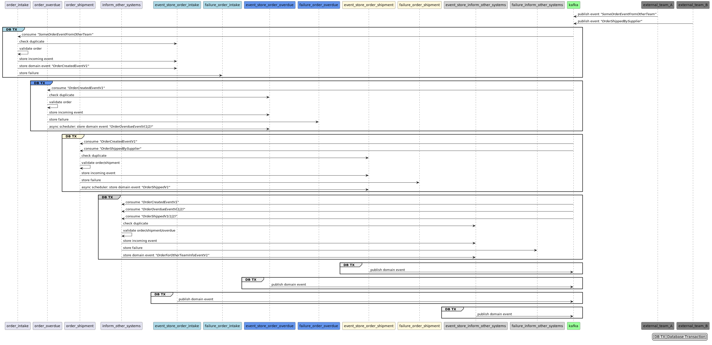
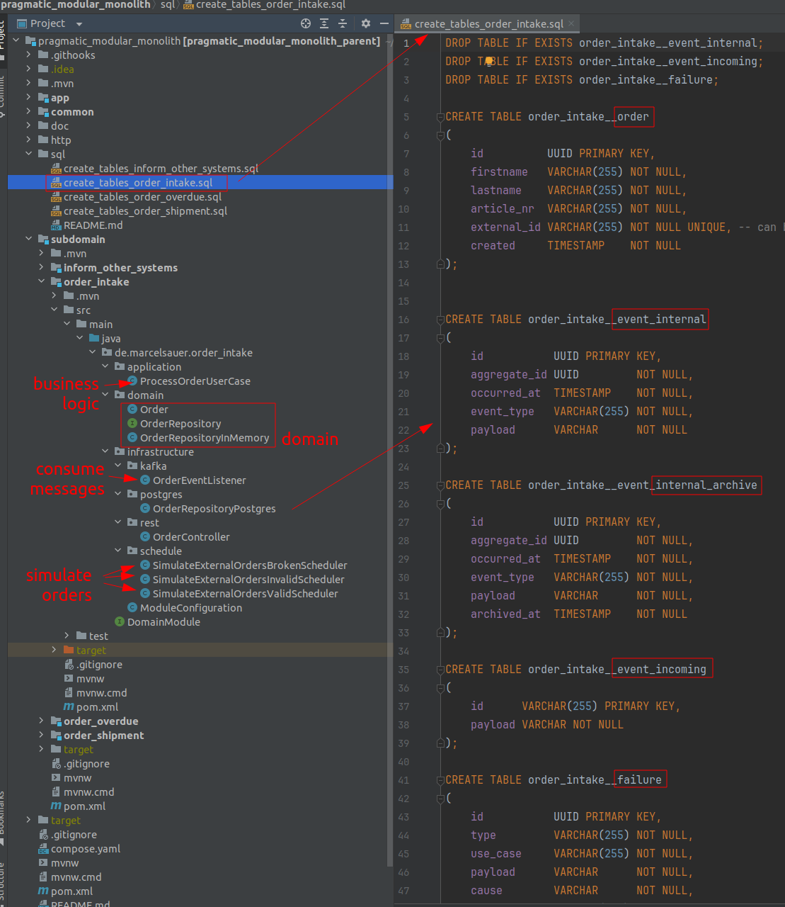

# Pragmatic Modular Monolith


<br/>

***Everything here is just work in progress and not meant for production use***

***Treat it as a rough draft and inspiration for your own projects***

This project is a pragmatic approach to building a modular monolith. 

It has four subdomains, each focusing on a specific business goal:

- order_intake: the main entry point for orders from external teams
  - "knows about all incoming orders"
- order_overdue: signals when an order is overdue
  - "knows about all orders that are overdue"
- order_shipment: handles external shipment events from another team
  - "knows about all shipped orders"
- inform_other_systems: sends events to other (external) systems/teams
  - "keeps track of all events and potentially sends updates to other systems/teams"

The ```app``` is the spring boot application that contains all the subdomains.

- All subdomains communicate via kafka topics which enables asynchronous communication between them.
- This is a showcase project and not meant for production use.
- It is meant to demonstrate how to build a modular monolith with kafka and hexagonal architecture.

All subdomains have minimal or no business logic ... just for inspiration :)

# Features

- Async communication between subdomains via Kafka
- Outbox Pattern for reliable event delivery
- Failure handling via db (incl. poison messages)
- Cloud Events for event schema
- Websocket endpoint showcase
- Rest endpoint showcase
- Encryption of sensitive data
- Hexagonal architecture
- Domain Driven Design (DDD)
- Spring Maven Multi Module Project

# Enables

- Different domain models for each subdomain and own database schema (here tables)
- Decoupling of subdomains via messaging
- Domain code that is not polluted with technical concerns (i.e. hexagonal architecture, clean architecture)

## Tech Stack

- Java
- Spring Boot
- Kafka (incl. AKHQ)
- Postgres
- Docker

# Starting Locally

You can start the whole application locally with docker-compose. The application will start a kafka cluster, a postgres database, and the spring boot application.
After the application was started some schedulers will simulate incoming events. This can be seen in the logs. You can also query the database to see the data and simulated failures for each subdomain.

```bash
docker compose up -d
mvn clean install -DskipTests
mvn spring-boot:run -f ./app/pom.xml

# watch the logs, app handles incoming events (simulated)
# open http://localhost:8082/ to see the websocket endpoint receiving events
# you could also start the application multiple times to simulate multiple instances

# to simulate some process time, the ```Sleep.java``` currently randomly pauses the processing
# you can adjust the sleep time in the ```Sleep.java``` 

# to simulate more traffic you can start the ```SimulateExternalOrderEventLoad.java```
```

**BEWARE**: you will see ERROR logs because some schedulers simulate broken events to showcase the failure handling.

```bash
13:09:57.730 ERROR [order-intake] could not deserialize incoming cloud event payload to target type 'de.marcelsauer.event.external.incoming.SomeOrderEventFromOtherTeam'
13:09:54.975 ERROR [order-shipment] could not deserialize incoming cloud event payload to target type 'de.marcelsauer.event.external.incoming.OrderShippedBySupplier'
```

# Peek into database

```bash
# password: testpw
psql -h localhost -U test test
```

# Sample UI (Websocket)

There is a very basic ui showing some websocket events flying in ...

open ```http://localhost:8082/```

# Sample Rest Endpoint

```http://localhost:8082/order-overdue/api/overdueOrders```

# AKHQ UI (Kafka UI, Topics, Consumer Groups etc.)

```http://localhost:9080/ui/docker-kafka-server/topic```

# Reset Kafka Offsets

- useful for testing duplicates handling

```http://localhost:8082/app/api/reset-consumer-offsets```

# Cleanup

in case you need to clean up the docker containers, volumes etc. deletes all containers and volumes on your machine. Be careful with this command!

```bash
docker stop $(docker ps -a -q); docker rm $(docker ps -a -q); docker volume rm $(docker volume ls -q)
```

# Architecture / Code




# Testing

```bash
vi ~/.testcontainers.properties
```

```properties
docker.client.strategy=org.testcontainers.dockerclient.UnixSocketClientProviderStrategy
testcontainers.reuse.enable=true
```

# todos

- pom cleanup
- failure hierarchy
- use case exception handling for each message
- clean up common/global_concept
- kafka listener topic reset
- event version + own package
- db schema versioning with liquibase or flyway
- aggregateid raus, order id rein

